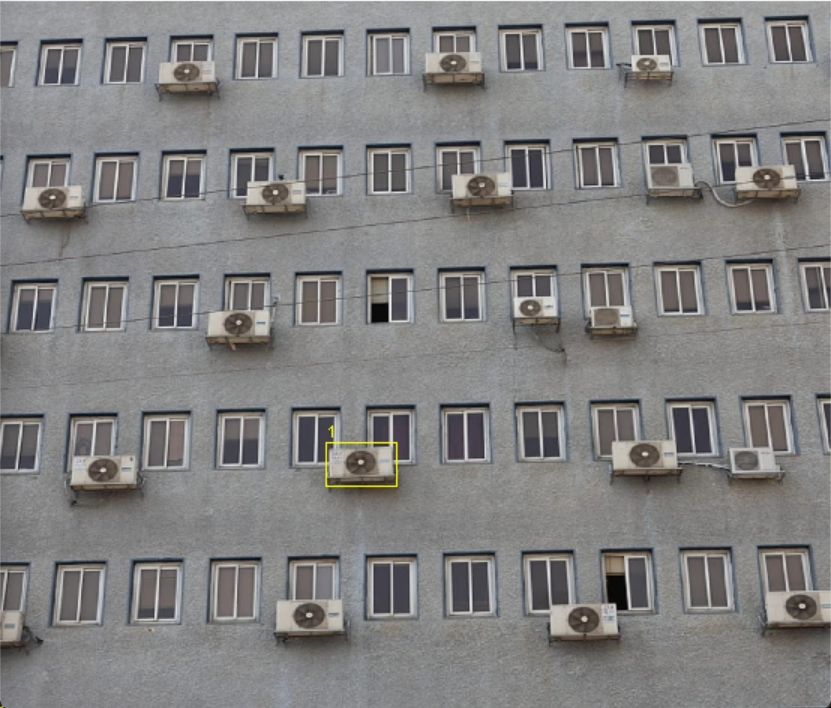

# VisOpenDet


##  Introduction
This project contains the official PyTorch implementation, pre-trained models, fine-tuning code, and inference demo for VisOpenDet.
* VisOpenDet is an innovative approach for open object detection based on interactive visual instruction prompts. It aims to provide superior performance and effectiveness, making it suitable for practical real-world applications. By leveraging interactive visual instructions, VisOpenDet can more accurately and efficiently identify and classify various objects in open environments, thereby meeting the stringent requirements for precision and reliability in real-world scenarios.
* VisOpenDet entails a Visual Select Knowledge Prompt(VSKP) module, and a prompt-Aware decoder module to improve the visual prompt understanding of the model.
* VisOpenDet shows significant performance improvement on COCO and LVIS benchmarks compared to previous methods, achieving better performance using significantly less data compared to T-Rex2 in zero-shot evaluation.VisOpenDet<sup>1</sup>, trained on O365-100K, achieves relative improvements of +9.9\% AP on COCO and +9.0\% AP on LVIS, which is comparable to T-Rex2<sup>1</sup> trained on a larger dataset (O365, HierText, OpenImages, CrowdHuman).
* Furthermore, VisOpenDet<sup>2</sup>, trained on O365, achieves relative improvements of +3.0\% AP on COCO, surpassing T-Rex2<sup>2</sup>, despite both being trained on similar datasets.

## Overview


## Model Zoo
| Model    | Pre-Train Data  | AP<sup>mv</sup> | AP<sub>r</sub>  | AP<sub>c</sub>  | AP<sub>f</sub>  | AP<sup>coco</sup> | Weights |
| -------- | --------------- | ---- | ---- | ---- | ---- | --------- | ------- |
| VisOpenDet<sup>1</sup> | O365-100K   | 49.6 | 62.8 | 56.5 | 41.1 | 51.0 / 58.6 |  [VisOpenDet1.pth/VisOpenDet1-finetune.pth] |
| VisOpenDet<sup>2</sup> | O365 | 58.3 | 71.5 | 65.3 | 49.7 | 59.6 / 63.0 |   [VisOpenDet2.pth/VisOpenDet2-finetune.pth]  |

 **NOTE**: *AP<sup>mv</sup> denotes the zero-shot evaluation results on LVIS MiniVal,  AP<sup>coco</sup> denotes (zero-shot / fine-tune) evaluation results on COCO, respectively.*


## Getting Started with Demo
### 1. Installation
```bash
# clone this project
git clone https://github.com/MengTanOwn/VisOpenDet.git
cd VisOpenDet
# create conda env for VisOpenDet
conda create -n vod -y
conda activate vod
pip install -r requirements.txt
```
### 2. Download Model weight
Move downloaded Model to ./model_weights. 

|Model Name|Link|Extraction code|
|---|---|---|
|VisOpenDet1.pth|https://pan.baidu.com/s/1shhceOdmfiOWsdKGYTpx4Q?pwd=v3z5 |v3z5|
|VisOpenDet1-finetune.pth|TODO|--|
|VisOpenDet2.pth|TODO|--|
|VisOpenDet2-finetune.pth|TODO|--|
### 3. Start Demo
Download Model weight and move to ./model_weights
```bash
python demo.py --image_path test_images/3.jpg --pre_score 0.4
```
* press "s" to save the box and input box label;
* press "q" to quit the box prompts and do inference.
* press "e" to quit the demo.
### 4. Demo examples
based on VisOpenDet1.pth
<div style="display: flex; justify-content: space-around;">
    <div style="text-align: center;">
        
        <br>
        <span>fig1: interactive visual instruct promt</span>
    </div>
    <div style="text-align: center;">
        
        <br>
        <span>fig2: target detect results</span>
    </div>
</div>

<div style="display: flex; justify-content: space-around; margin-top: 20px;">
    <div style="text-align: center;">
        
        <br>
        <span>fig3: interactive visual instruct promt</span>
    </div>
    <div style="text-align: center;">
        
        <br>
        <span>fig4: target detect results</span>
    </div>
</div>

<div style="display: flex; justify-content: space-around; margin-top: 20px;">
    <div style="text-align: center;">
        
        <br>
        <span>fig5: interactive visual instruct promt</span>
    </div>
    <div style="text-align: center;">
        
        <br>
        <span>fig6: target detect results</span>
    </div>
</div>
